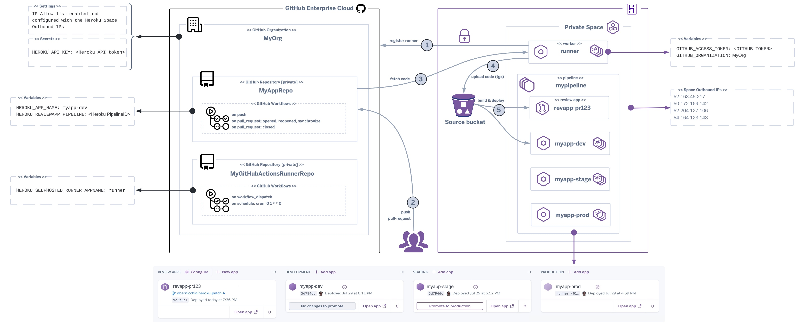

## Heroku-hosted runner for GitHub Actions

This project defines a `Dockerfile` to run a custom Heroku-hosted runner for Github Actions (see also [self-hosted runners](https://docs.github.com/en/actions/hosting-your-own-runners/about-self-hosted-runners)).

The runner is hosted on [Heroku as a docker image](https://devcenter.heroku.com/articles/build-docker-images-heroku-yml) via `heroku.yml`.

## How it works

Once the self-hosted runner is running on Heroku you can start adding workflows to your private GitHub repositories to automate Heroku Review Apps creation and Heroku Apps deploys using the following action (that includes worflows examples):
- https://github.com/heroku-reference-apps/github-heroku-flow-action



The Heroku-hosted runner will autoregister with your GitHub Org **(1)**. When git push / pull-request commands are executed toward your private GitHub repository **(2)** your workflows will trigger the code fetch from your repository **(3)**.<br/>
The source code will be automatically compressed and uploaded to a temporary Heroku bucket **(4)** then built and deployed to your apps **(5)**. When a pull request is created a new Review App is created and once it is closed the associated Review App is automatically removed.


## Disclaimer
The author of this article makes any warranties about the completeness, reliability and accuracy of this information. **Any action you take upon the information of this website is strictly at your own risk**, and the author will not be liable for any losses and damages in connection with the use of the website and the information provided. **None of the items included in this repository form a part of the Heroku Services.**

## Quick Start

**Things you'll need**

- Administrator access to your GitHub organization
- Administrator access to your Heroku organization
- GitHub personal access token (classic) with **admin:org** and **repo** scopes or fine-grained token with **"Self-hosted runners" organization permissions (read and write)** (see [here](https://docs.github.com/en/enterprise-cloud@latest/rest/actions/self-hosted-runners?apiVersion=2022-11-28#create-a-registration-token-for-an-organization))
- Heroku API token from a non-SSO user (service/automation user) with **view** and **deploy** access
- [Heroku CLI](https://devcenter.heroku.com/articles/heroku-cli)
- [Git CLI](https://git-scm.com/)

The setup requires configurations in both your GitHub organization and your Heroku organization.

You will switch between them throughout the following instructions.

1. In GitHub, enable GitHub Actions for your organization
    - https://github.com/organizations/{YOUR_ORGANIZATION}/settings/actions
    - Under **Policies**
        - Choose **Allow {YOUR_ORGANIZATION}, and select non-{YOUR_ORGANIZATION}, actions and reusable workflows**
        - Select **Allow actions created by GitHub**
        - Click **Save**

2. In GitHub, add your Heroku Private Space's outbound IP addresses to your organization's allow list (see this [article](https://docs.github.com/en/enterprise-cloud@latest/organizations/keeping-your-organization-secure/managing-security-settings-for-your-organization/managing-allowed-ip-addresses-for-your-organization#adding-an-allowed-ip-address)) and check the **Enable IP allow list** box
    - https://github.com/organizations/{YOUR_ORGANIZATION}/settings/security

3. In GitHub, create a personal access token with **admin:org** and **repo** scopes (see these articles [1](https://docs.github.com/en/enterprise-server@3.9/authentication/keeping-your-account-and-data-secure/managing-your-personal-access-tokens#creating-a-personal-access-token), [2](https://docs.github.com/en/rest/actions/self-hosted-runners?apiVersion=2022-11-28#create-a-registration-token-for-an-organization)) or a fine-grained token with **"Self-hosted runners" organization permissions (read and write)** (see [here](https://github.blog/security/application-security/introducing-fine-grained-personal-access-tokens-for-github/#creating-personal-access-tokens)). This token will be used only to configure the runner. Authenticated users must have admin access to the organization. (see [here](https://docs.github.com/en/enterprise-cloud@latest/rest/actions/self-hosted-runners?apiVersion=2022-11-28#create-a-registration-token-for-an-organization)). 
    > Don't forget to authorize your access token to SSO to your organization

4. In Heroku, create a new app in your private space

5. In Heroku, add the following configuration variables to the new app
    - `GITHUB_ACCESS_TOKEN` [required] with the token you created previously
    - `GITHUB_ORGANIZATION` [required] with the name of your organization
    - `GITHUB_RUNNER_LABELS` [optional] custom labels that will be added to the runner (e.g. L1,L2,L3)
    - `GITHUB_RUNNER_GROUP` [optional] name of the runner group to add the runner to (see also this [article](https://docs.github.com/en/actions/hosting-your-own-runners/managing-self-hosted-runners/managing-access-to-self-hosted-runners-using-groups#creating-a-self-hosted-runner-group-for-an-organization))
    - `HIDDEN_ENV_VARS` [optional] list of space separated env vars that has to be hidden to the runner and workflows to avoid being logged to the GitHub logs (e.g. MYTOKEN1 MYSECRET2 MYPASSWORD3)


6. From the Heroku CLI login as the service/automation Heroku user to create an API token (SSO users cannot create tokens)

7. Generate a new Heroku API key
    - `heroku authorizations:create -d "GitHub self-hosted actions automation" --expires-in=<set expiration time in seconds>` setting an adequate expiration time

8. Login as the Heroku administrator and grant the service/automation Heroku user access to **view** and **deploy** to your new app
    - https://dashboard.heroku.com/apps/{YOUR_APP}/access

9. In GitHub, add an organization secret to store the Heroku information
    - https://github.com/organizations/{YOUR_ORGANIZATION}/settings/secrets/actions
    - `HEROKU_API_KEY` with the api key you created previously

10. In GitHub, add an organization/repository variable to store the Heroku self-hosted runner app name
    - https://github.com/organizations/{YOUR_ORGANIZATION}/settings/variables/actions
    - https://github.com/{YOUR_ORGANIZATION}/{YOUR_REPOSITORY}/settings/variables/actions
    - `HEROKU_SELFHOSTED_RUNNER_APPNAME` with the name of the Heroku self-hosted runner app

11. Import the content of this repository into your own private repository within your GitHub Org to enable the manual and scheduled rebuild of the runner image. Alternatively, clone locally and deploy this repository to your Heroku app or click on the Heroku Button for a quick installation.

    [](https://heroku.com/deploy)

    ```shell
    git clone https://github.com/heroku-reference-apps/github-self-hosted-runner-for-github-actions.git
    heroku git:remote --app HEROKU_SELFHOSTED_RUNNER_APPNAME
    heroku apps:stacks:set --app HEROKU_SELFHOSTED_RUNNER_APPNAME container
    git push heroku main
    ```

12. In Heroku, scale your **runner** resource appropriate for your expected usage
    - https://dashboard.heroku.com/apps/{YOUR_APP}/resources
    - A single dyno can run one GitHub Actions job at a time
    - Even small dynos are usually enough (e.g. private-S)

Now when GitHub Action workflows are launched by your repositories, GitHub will orchestrate
with your Heroku-hosted runner to do the work just as if you were using GitHub-hosted runners.

## Keeping Your Runner Updated

GitHub frequently releases updates to the GitHub Action runner package.

If you don't keep the package up-to-date within 30 days then [GitHub won't enqueue jobs](https://docs.github.com/en/actions/hosting-your-own-runners/managing-self-hosted-runners/autoscaling-with-self-hosted-runners#controlling-runner-software-updates-on-self-hosted-runners).

This project includes a workflow that can be run manually or automatically scheduled (e.g. once a week). It will rebuild the docker container and download the latest updates and it will deploy to your Heroku self-hosted runner app automatically.

To take advantage of the above automation you need to [fork](https://docs.github.com/en/pull-requests/collaborating-with-pull-requests/working-with-forks/fork-a-repo) or [mirror](https://docs.github.com/en/repositories/creating-and-managing-repositories/duplicating-a-repository#mirroring-a-repository-in-another-location) this repository to your private organisation's repository and enable workflows run.

If you need to implement version pinning to avoid potential supply chain vulnerabilities, it's possible to configure a specific runner version (see `RUNNER_VERSION` in heroku.yml). In this case you'll have to modify manually the version and run the above mentioned workflow manually and the scheduled workflow execution can be disabled.

Whenever the runner package is downloaded (either the latest or a specific version) the SHA256 checksum is verified, if the computed checksum does not match with the expected one the build fails.

## Technical Notes
This new release:
- Uses https://github.com/heroku-reference-apps/github-heroku-flow-action GitHub Action to build and deploy the runner on Heroku and update it on schedule or manually
- Uses ephemeral compute to allow [autoscaling](https://docs.github.com/en/actions/hosting-your-own-runners/managing-self-hosted-runners/autoscaling-with-self-hosted-runners#using-ephemeral-runners-for-autoscaling) and [hardening](https://docs.github.com/en/actions/security-guides/security-hardening-for-github-actions#hardening-for-self-hosted-runners) of self-hosted runners. Ephemeral runners are short-lived containers that are executed only once for a single job, providing isolated environments to reduce the risk of data leakage
- Uses a [base image](https://devcenter.heroku.com/articles/stack) that is curated and maintained by Heroku
- Logs the self-runner name to manage it from the GitHub dashboard
- Reduces the Docker image footprint and it's possible to run it as one-off dyn
- Includes all the recent GitHub self-hosted runners features (e.g. labels, groups, ...) and streamlines the configuration and setup
- Integrates the [Heroku Button](https://www.heroku.com/elements/buttons) to install the runner in one-click
- Supports fine-grained GitHub tokens for granular permission control

## Security Notes and Recommendations
Below are summarised some general recommendations to improve security for using GitHub Actions and self-hosted runners, for a complete guide and further details please refer to [Security hardening for GitHub Actions](https://docs.github.com/en/actions/security-for-github-actions/security-guides/security-hardening-for-github-actions):
- Using self-hosted runners with private repositories. This is because forks of your public repository can potentially run dangerous code on your self-hosted runner machine by creating a pull request that executes the code in a workflow
- Disable [Run workflows from fork pull requests](https://docs.github.com/en/repositories/managing-your-repositorys-settings-and-features/enabling-features-for-your-repository/managing-github-actions-settings-for-a-repository#enabling-workflows-for-forks-of-private-repositories) as it could be a potential source of leakage for secrets running in workflows. This option tells Actions to run workflows from pull requests originating from repository forks. Note that doing so will give maintainers of those forks the ability to use tokens with read permissions on the source repository
- Using only audited actions for specific GitHub Org(s), this can be enforced at GitHub level through [policies](https://docs.github.com/en/enterprise-cloud@latest/admin/enforcing-policies/enforcing-policies-for-your-enterprise/enforcing-policies-for-github-actions-in-your-enterprise#enforcing-policies)
- Using [Push rulesets](https://docs.github.com/en/enterprise-cloud@latest/repositories/configuring-branches-and-merges-in-your-repository/managing-rulesets/about-rulesets#push-rulesets) to block pushes to private/internal repos based on files paths. This can prevent changing the original Workflow or action and inject malicious code
- Configuring a HEROKU_API_KEY at Repo level instead of Org level. This key can be tied to a Heroku user account that has limited permissions to a specific app (the one tied with the repository) limiting the attack area (to others app) in case the HEROKU_API_KEY is being leaked or stolen
- Using Runner Groups to [restrict runners to specific repos](https://docs.github.com/en/actions/hosting-your-own-runners/managing-self-hosted-runners/managing-access-to-self-hosted-runners-using-groups#changing-which-repositories-can-access-a-runner-group)
- Using dependabot to keep your repositories and Actions up to date. Dependabot can run on GitHub runners [free of charge](https://github.blog/changelog/2024-05-13-dependabot-core-is-now-open-source-with-an-mit-license/)
- Being cautious when adding outside collaborators on GitHub — users with read permissions can view logs for workflow failures, view workflow history, as well as search and download logs
- Handling secrets, tokens and keys securely (e.g. using secrets in [GitHub Actions](https://docs.github.com/en/actions/security-for-github-actions/security-guides/using-secrets-in-github-actions))
- Avoiding script injections, using an action instead of an inline script
- Isolating the runners from other environments if you want to limit potential access due to software bugs or security issues
- The amount of sensitive information in the runner environment should be kept to a minimum, always be mindful that any user capable of invoking workflows has access to this environment
- Accessing to logs and/or secrets through forked repositories should be examined
- Auditing and rotating registered secrets
- Consider requiring review for access to secrets
- Using [CODEOWNERS](https://docs.github.com/en/repositories/managing-your-repositorys-settings-and-features/customizing-your-repository/about-code-owners) to monitor repository changes
- Using [workflow templates](https://docs.github.com/en/actions/writing-workflows/using-workflow-templates) for code scanning
- Restricting permissions for tokens / permissions for the GITHUB_TOKEN
- Restricting [default permissions](https://docs.github.com/en/actions/security-for-github-actions/security-guides/automatic-token-authentication) granted to GITHUB_TOKEN when running workflows (e.g. Read repository contents and package permissions)
- Using third-party Actions: pin actions to a full length commit SHA, audit the source code, pin actions to a tag only if you trust the creator
- Prevent GitHub Actions from creating or approving pull requests
- Using [OpenSSF Scorecards](https://docs.github.com/en/actions/security-for-github-actions/security-guides/security-hardening-for-github-actions#using-openssf-scorecards-to-secure-workflow-dependencies) to secure workflows
- Evaluating potential impact of a compromised runner (e.g. accessing secrets, exfiltrating data from a runner, stealing the job's GITHUB_TOKEN, modifying the contents of a repository, ...)
- Considering [cross-repository access](https://docs.github.com/en/actions/security-for-github-actions/security-guides/security-hardening-for-github-actions#considering-cross-repository-access)
- Auditing GitHub Actions events
- Using the runner HIDDEN_ENV_VARS to avoid logging sensible runner environment variables to GitHub logs
- Conducting regular security audits of GitHub Actions workflows and Heroku configurations
- Implementing mandatory code reviews for all workflow changes
- Implementing branch protection rules to limit PRs to trusted contributors or specific branches
- Using Heroku's Review Apps feature to isolate test environments from production
- Using Heroku's Config Vars feature with the least privilege principle, only granting access to variables to allowed users


## Limits and Considerations
- As the runner image is not based on the [standard GitHub dockerfile](https://github.com/actions/runner/blob/main/images/Dockerfile) then some Actions might not work as expected
- Currently, it's not possible to run GitHub Actions requiring docker/rootless-docker as they need higher privileges that are not allowed on Heroku dynos for security reasons
- The runner cannot be executed on [Fir](https://devcenter.heroku.com/changelog-items/3071) yet, requiring an ARM based image


## Credits
Credits to the [owner](https://github.com/douglascayers/heroku-github-actions-runner) of the original project, whose work inspired this entirely reimagined new version.
 